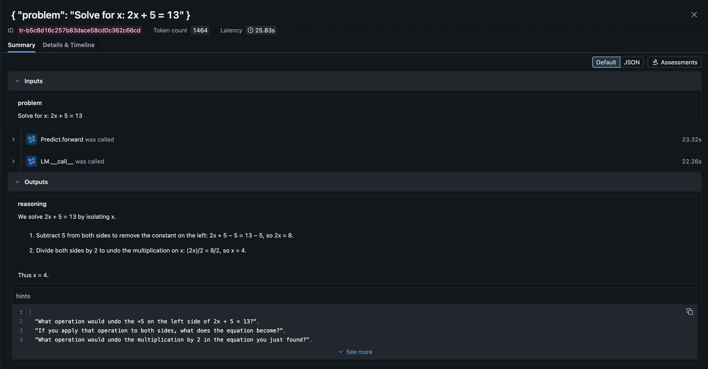

# HINTy: Math Hint Generation with DSPy

An intelligent problem solving system that generates progressive hints for math problems. Powered by DSPy and GPT-5-mini. Personal project for learning DSPy.

## Live Demo
Check it out here: [https://hinty.onrender.com](https://hinty.onrender.com)

(I'm deploying the website on the Render free plan, so it takes around ~50 seconds for the website to start up. Sorry!)

## Features
The backend prompts GPT-5-mini using [**DSPy**](https://dspy.ai/), a library that "compiles AI programs into effective prompts" for language models. Instead of directly prompting GPT, DSPy allows builders to work with modularized Python code, which is then converted into LM prompts (analogous to C code being compiled into assembly, for example.) All the DSPy used in this project is in `hinty.py`. 

The app also traces all LM calls using MLflow, to understand how the LM behaves under the hood (ex. looking at how the LM reasons in a Chain-of-Thought prompt, below.) 

The MLflow server is hosted on Dagshub.

The app is built with Flask, with Vanilla JavaScript + CSS + HTML for the frontend.

## Evaluating our DSPy Program
The DSPy Signatures and Modules used in this project are in `hinty.py`. The signature `MathHintsGenerator` is used to generate a list of sequential hints to a math problem, and the signature `AnswerChecker` is used to check if an inputted solution correctly answers the given problem. The task of checking whether two math expressions are the same is annoying (ex. "2/3" and "two-thirds" and "\frac{2}{3}" should all be correct); prompting GPT makes this task much easier and natural, at the cost of increased latency.

The quality of our app is mainly dependent on the quality of our hint generator. To evaluate the hints generated by our program, we score each hint on the following criteria:
- Does the hint guide toward solution without revealing the answer?
- Does the hint use questions to prompt thinking rather than just stating facts?
- Does the hint draw attention to relevant data, unknowns, or conditions?
- Does the hint suggest a concrete, actionable next step?
- Is the hint at appropriate difficulty level for this stage?
- If not first hint, does it build logically on previous hints?

These hints are based off of Chapter 1 of George Pólya's [*How to Solve It*](https://en.wikipedia.org/wiki/How_to_Solve_It). 

We use a "LLM-as-a-Judge" evaluator to score the generated hints based on the above criteria. This means that we use a separate DSPy program that takes hints as input, and outputs a grade based on the above rubric. In other words, we use LMs to emulate a human individually grading each of the generated hints.

The evaluation code is in the notebook `experiments/hinty.ipynb`, and our LLM-as-a-Judge evaluator is the DSPy module `HintMetric`. Using this metric, our hint generator scores **95.1%** on a subset of the [hendrycks/MATH](https://github.com/hendrycks/math) dataset.

## Next Steps
A big feature of DSPy is the ability to *optimize* AI modules. The library contains prompt optimizers that fine-tunes the prompts compiled from the DSPy modules, to improve the program's performance on a specific task. Since HINTy already performs well with respect to our LLM-as-a-Judge evaluator, optimizing our current evaluation pipeline doesn't seem very effective (optimization also costs a lot of $$ in API credits...)

Instead, here are some possible next steps for improving our AI pipeline:
- Improve our metric `HintMetric`. One way to do this is by grading a few hints by hand to produce gold-label examples, then to optimize the metric using a DSPy optimizer. Another way to do this is by reflecting on our current criterion, and making larger changes to the metric.
- Evaluate our `AnswerChecker` to see the proportion of questions that GPT-5-mini can answer correctly/incorrectly.

Here are also some places for improvement from a user experience perspective:
- The time it takes to call the OpenAI API and generate a list of hints is currently super long, taking around 30 seconds! We can try decreasing this latency, for example by asynchronously calling the API in the background.
- There are currently no safeguards in place to detect if a user inputs a math question: they can input any text as a "math question," and irrelevant prompts confuses our program. We can try detecting whether a user inputted a valid math problem using another DSPy module.
